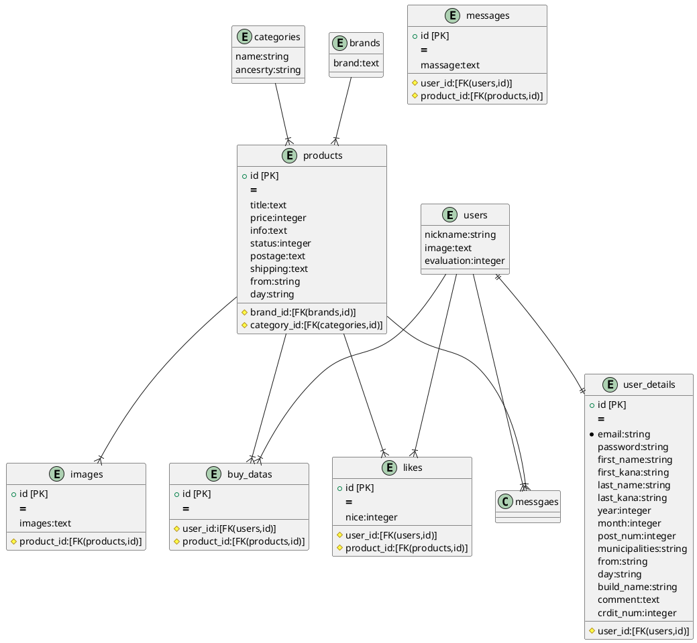

# README

This README would normally document whatever steps are necessary to get the
application up and running.

Things you may want to cover:

* Ruby version

* System dependencies

* Configuration

* Database creation

* Database initialization

* How to run the test suite

* Services (job queues, cache servers, search engines, etc.)

* Deployment instructions

* ...

# freemarket_sample_65e DB設計

## usersテーブル
|Column|Type|Options|
|------|----|-------|
|nickname|string|null: false|
|image|text||
|evaluation|integer||
### Association
- belongs_to :user-detail
- has_many :buy_datas
- has_many :products, through: :buy_datas
- has_many :likes
- has_many :messages

# user_detailsテーブル
|Column|Type|Options|
|------|----|-------|
|user_id|string|null: false|
|email|string|null: false, unique|
|password|string|null: false||
|first_name|string|null: false|
|first_kana|string|null: false|
|last_name|string|null: false|
|last_kana|string|null: false|
|year|integer|null: false|
|month|integer|null: false|
|day|integer|null: false|
|post_num|integer|null: false|
|from|string|null: false|
|municipalities|string|null: false|
|build_name|string||
|comment|text||
|crdit_num|integer||
### Association
- belongs_to :user

## productsテーブル
|Column|Type|Options|
|------|----|-------|
|title|text|null: false|
|price|integer|null: false|
|info|text||
|status|string|null: false|
|postage|text|null: false|
|shipping|text|null: false|
|from|string|null: false|
|day|string|null: false|
|brand_id|integer|foreign_key: true|
|category_id|integer|null: false, foreign_key: true|
### Association
- belongs_to :category
- belongs_to :brand
- has_many :images
- has_many :messages
- has_many :likes
- has_many :buy_datas
- has_many :users, through: :buy_datas

## categoriesテーブル
|Column|Type|Options|
|------|----|-------|
|name|string|null: false|
|ancestry|string|null: false|
### Association
- has_ancestry

## messagesテーブル
|Column|Type|Options|
|------|----|-------|
|message|text||
|user_id|integer|null: false, foreign_key: true|
|products_id|integer|null: false, foreign_key: true|
### Association
- belongs_to :user
- belongs_to :product

## imagesテーブル
|Column|Type|Options|
|------|----|-------|
|image|text|null: false|
|product_id|integer|null: false, foreign_key: true|
### Association
- belongs_to :product

## brandsテーブル
|Column|Type|Options|
|------|----|-------|
|brand|text||
### Association
- has_many :products

## buy_datasテーブル
|Column|Type|Options|
|------|----|-------|
|user_id|integer|null: false, foreign_key: true|
|product_id|integer|null: false, foreign_key: true|
### Association
- belongs_to :user
- belongs_to :product

## likesテーブル
|Column|Type|Options|
|------|----|-------|
|nice|integer||
|user_id|integer|null: false, foreign_key: true|
|product_id|integer|null: false, foreign_key: true|
### Association
- belongs_to :product

