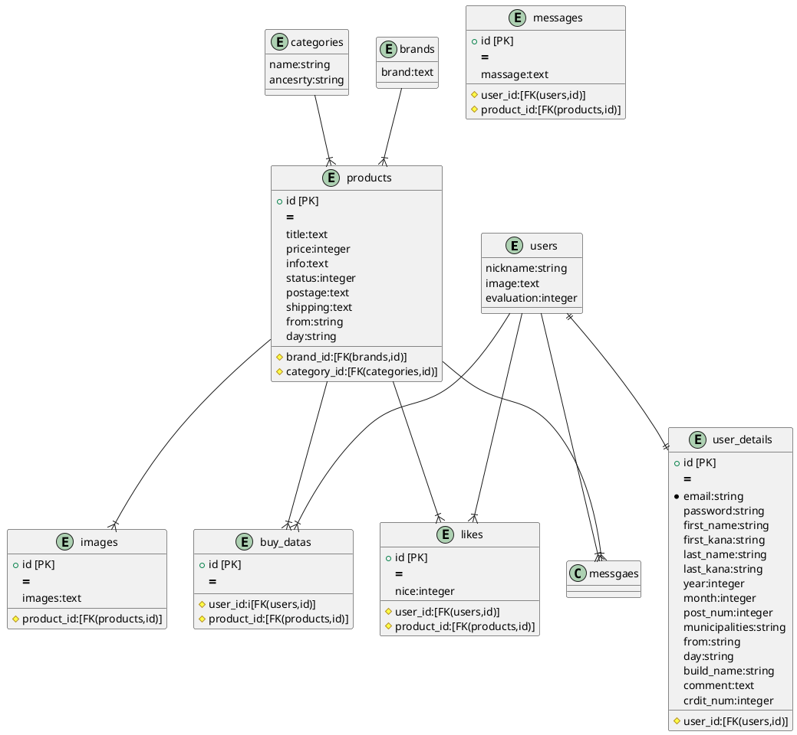

```puml

@startuml
entity "users" {
  nickname:string
  image:text
  evaluation:integer
}

entity "products" {
  + id [PK]
    ==
 title:text
 price:integer
 info:text
 status:integer
 postage:text
 shipping:text
 from:string
 day:string
 #brand_id:[FK(brands,id)]
 #category_id:[FK(categories,id)]
}

entity "messages" {
  + id [PK]
    ==
  massage:text
  # user_id:[FK(users,id)]
  # product_id:[FK(products,id)]
}

entity "categories" {
  name:string
  ancesrty:string
}

entity "images" {
  + id [PK]
    ==
  # product_id:[FK(products,id)]
  images:text
}


entity "buy_datas" {
  + id [PK]
    ==
  # user_id:i[FK(users,id)]
  # product_id:[FK(products,id)]
}


entity "brands" {
  brand:text
}

entity "likes" {
  + id [PK]
    ==
  nice:integer
  # user_id:[FK(users,id)]
  # product_id:[FK(products,id)]
}

entity "user_details" {
  + id [PK]
    ==
 # user_id:[FK(users,id)]
 * email:string
 password:string
 first_name:string
 first_kana:string
 last_name:string
 last_kana:string
 year:integer
 month:integer
 post_num:integer
 municipalities:string
 from:string
 day:string
 build_name:string
 comment:text
 crdit_num:integer
 }

products --|{ images
products --|{ messgaes
products --|{ likes
products --|{ buy_datas
users --|{ messgaes
users --|{ likes
users --|{ buy_datas
users||--||user_details
categories --|{ products
brands --|{ products

@enduml

```

