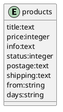

```puml
@startuml
entity "products" {
 title:text
 price:integer
 info:text
 status:integer
 postage:text
 shipping:text
 from:string
 days:string
}
@enduml

@startuml
entity "messages" {
  massage:text
  #user_id:integer
  #product_id:integer
}
@enduml

@startuml
entity "categories" {
  name:string
  ancesrty:string
}
@enduml

@startuml
entity "images" {
  #product_id:integer
  images:text
}
@enduml

@startuml
entity "buy_datas" {
  #user_id:integer
  #product_id:integer
}
@enduml

@startuml
entity "buy_datas" {
  #user_id:integer
  #product_id:integer
}
@enduml

@startuml
entity "brands" {
  brand:text
  product_id:integer
}
@enduml

@startuml
entity "brands" {
  brand:text
  #product_id:[FK(,id)]
}
@enduml


```

